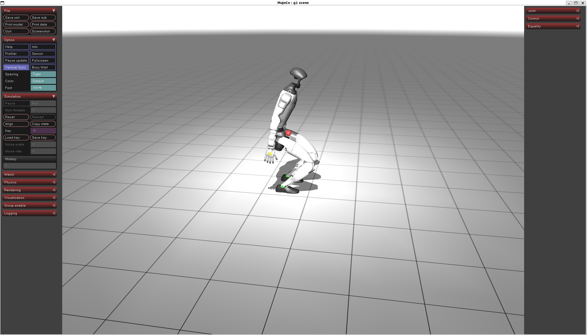

# opt2skill-experiments

An independent, learning-focused implementation of trajectory-generation experiments
inspired by [Opt2Skill](https://opt2skill.github.io/), using the Unitree G1 humanoid.
Specify a squat, optimize it with Crocoddyl and Pinocchio, then validate and replay
it in MuJoCo. This is not the paper authors' official implementation.



*G1 squat visualization in MuJoCo, with reference keypoints shown as colored spheres.*

## Features and scope

- Compare Pinocchio and MuJoCo models using shared joint order, limits, and frames.
- Optimize whole-body squats with both feet planted, including joint torque and
  contact-wrench references.
- Generate randomized datasets with feasibility filtering and train/validation/test splits.
- Check inverse-dynamics agreement and simulate feedforward-plus-PD tracking.
- View planned motion and physics replay with reference keypoints.
- Inspect an action-driven tracking environment with per-substep diagnostics and plots.

The Python package is named `o2s`. Policy training, changing contact schedules,
manipulation, and hardware deployment are not implemented. The existing replay
controller is a simulation baseline, not a trained policy.

## Requirements

- Ubuntu, either natively or under WSL2 on Windows. Development and verification
  have used Ubuntu 26.04 under WSL2; other Ubuntu releases are not yet verified.
- Python **3.12**, managed below with [uv](https://docs.astral.sh/uv/getting-started/installation/).
- Git and an internet connection for Python dependencies and robot assets.
- A graphical desktop with OpenGL for the interactive viewer; WSL users need
  [WSLg support](https://learn.microsoft.com/en-us/windows/wsl/tutorials/gui-apps).

Trajectory optimization and numerical validation run on the CPU; CUDA is not
required. Use the Linux environment for all Python commands on Windows.

## Installation

### Windows: install Ubuntu with WSL2

If WSL is not installed, run this in an **administrator PowerShell** window:

```powershell
wsl --install -d Ubuntu
```

Restart if prompted, open Ubuntu, and complete the Linux user setup. Check
`wsl --list --verbose` in PowerShell to confirm the distribution uses WSL2.
See Microsoft's [WSL installation guide](https://learn.microsoft.com/en-us/windows/wsl/install)
for existing installations or alternative distributions.

Continue below in the Ubuntu terminal. Native Ubuntu users can start here directly.

### Ubuntu: clone and install

Install Git if needed, and install `uv` using its
[installation instructions](https://docs.astral.sh/uv/getting-started/installation/).

```bash
sudo apt update
sudo apt install -y git

git clone https://github.com/Oszkar/opt2skill-experiments.git
cd opt2skill-experiments
uv venv .venv --python 3.12.14
source .venv/bin/activate
uv pip sync --require-hashes requirements/trajectory.lock
uv pip install --no-deps -e .
bash scripts/fetch_assets.sh
```

Run subsequent commands from the repository root with the virtual environment
active. In a new terminal, return to the repository and run
`source .venv/bin/activate` again.

The asset script fetches pinned revisions of Unitree ROS, MuJoCo Menagerie, and
MuJoCo Playground into `~/o2s_third_party`. To use another location, set
`O2S_THIRD_PARTY` before fetching **and** whenever running the tools. Keep the
Crocoddyl and Pinocchio versions pinned in `pyproject.toml`: incompatible binary
versions can crash the solver. The dependency lock targets Linux x86_64; see
[reproducibility instructions](docs/REPRODUCIBILITY.md) for updates and provenance.
Third-party robot assets retain their own licenses.

## Quick start

Check the models, then generate and validate a 20 cm squat:

```bash
python -m o2s.models.reconcile
python -m o2s.trajopt.solve_one --depth 0.2 --out data/refs/dev/squat_dev.npz
python -m o2s.reference.validate data/refs/dev/squat_dev.npz
```

Reconciliation should print ten `[ok]` results. Validation should print `[ok]` for
inverse dynamics and feedforward replay, plus an `[info]` PD-only comparison.
PD-only replay falls on the tested default squat; that informational result does
not make validation fail.

View the motion, closing each window before running the next command:

```bash
python -m o2s.reference.view data/refs/dev/squat_dev.npz --mode kinematic --loop
python -m o2s.reference.view data/refs/dev/squat_dev.npz --mode replay --loop
```

**Kinematic** mode poses the robot directly from the reference. **Replay** mode
simulates reference torque plus PD feedback. If a display is unavailable, skip
the viewer; generation and numerical validation do not require a window.

Change `--depth`, `--t-down`, `--t-hold`, `--t-up`, or `--com-shift-x` to experiment.
Use a different output filename for each attempt. The solver exits with failure
when a motion fails the feasibility filter and normally does not write a file;
an older output at the same path would remain. Run `--help` on `solve_one`,
`generate`, or `view` for their options.

## Inspect the tracking environment

Run a scripted joint-target controller through the minimal reset/step environment:

```bash
python -m o2s.tracking.inspect data/refs/dev/squat_dev.npz --controller reference --out runs/inspect_01
```

This headless command writes `diagnostics.png`, `steps.csv`, `trace.npz`, and
`summary.json`. It uses the original actuator gains and no feedforward torque;
a fall is a recorded controller outcome, not a reference-validation failure.
See the [tracking environment guide](docs/TRACKING_ENV.md) for action/observation
conventions, reward components, and how to inspect the trace. No RL framework is
required and no policy is trained yet.

Use `--controller stabilized-pd` or `--controller stabilized-ff` for matched
validation-controller comparisons. Add `--view` to watch MuJoCo with live terminal
metrics; see [the comparison guide](docs/TRACKING_ENV.md#compare-the-validation-controller).

Add `--equations` for optimizer cost components, dynamics balance and sole-motion
plots, plus CLI values during the run. See [the equation guide](docs/TRACKING_EQUATIONS.md).

Simulator settings, nominal gains/damping, and the stabilized controller preset
are explicit in [the shared configuration](configs/g1_reconcile.yaml). New runs
record their actual settings; see [reproducibility notes](docs/TRACKING_ENV.md#reproducible-simulation-settings).

## Generate a dataset

```bash
python -m o2s.trajopt.generate --n 100 --out data/refs/squats_01 --seed 0
```

Outputs include reference `.npz` files, `split.json`, `summary.json`,
`rejected.jsonl`, and a `manifest.json` with source/config/package/asset provenance
and file hashes. Verify a completed dataset with
`python -m o2s.provenance data/refs/squats_01` before using its recorded split.
Generated data is ignored by Git and is not included in a clone.
Choose a **new or empty output directory**: the generator rejects any nonempty
directory before loading models or writing files. It does not resume existing runs.

Dataset acceptance requires optimization feasibility, inverse-dynamics agreement,
exported torque within limits, and total feedforward-plus-PD torque within limits
at every replay physics substep. Other replay tracking failures are recorded but
do not reject a trajectory; inspect those results before training.

## Tests and limitations

```bash
python -m pytest -q
```

Use the locked installation above (it includes `trajopt` and `dev` dependencies)
and fetch the assets before running the full suite. Asset-dependent tests skip when assets are missing, but test
collection still imports the simulation packages.

Validation measures agreement between two models and tracking under a specific
controller, including total drive torque at every simulated physics substep. It
does not establish hardware readiness. Loading rejects empty trajectories, invalid
20 ms time grids, inconsistent duplicate base states, and conflicting metadata.
Squat parameters are validated before solving. Rotated-foot
wrench conventions remain unverified. See [next steps](docs/NEXT_STEPS.md)
and the [reference conventions](docs/TRAJECTORY_GUIDE.md#reference-conventions-and-limitations).

## Documentation and learning materials

- [Hands-on guide](docs/TRAJECTORY_GUIDE.md): code map, experiments, and reference conventions.
- [Visual guide](docs/TRAJECTORY_DIAGRAMS.md): optimization, export, and simulation diagrams.
- [Tracking environment](docs/TRACKING_ENV.md): reset/step interface and diagnostics.
- [Next steps](docs/NEXT_STEPS.md): reliability improvements and proposed policy training.
- [Reproducibility](docs/REPRODUCIBILITY.md): locked installation and dataset manifests.
- [Knowledge base](KNOWLEDGEBASE.md): research notes, historical measurements, and environment gotchas.
- [Study booklet](<Opt2Skill Study Booklet.html>) and [saved paper](Opt2Skill_paper.htm):
  download or open the local HTML files in a browser; GitHub's file view is not an HTML viewer.

Use this README and the hands-on guide for current behavior. Historical learning
notes may describe earlier experiments or proposed features.

Bug reports and focused improvements are welcome. For reproducible reports,
include the command, Python and dependency versions, and relevant error output.
