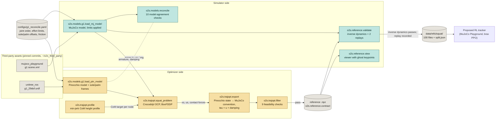
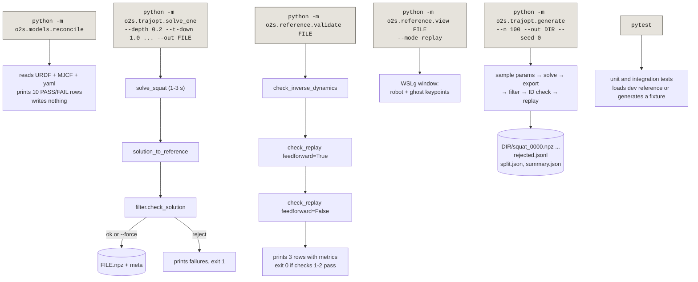
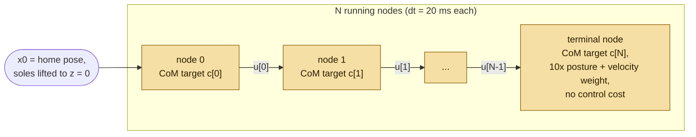
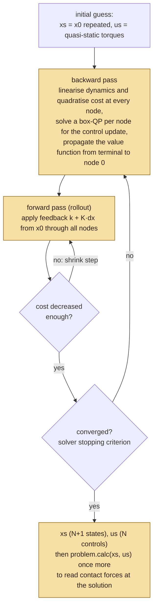
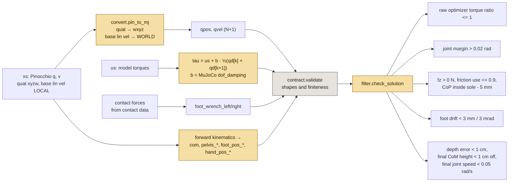
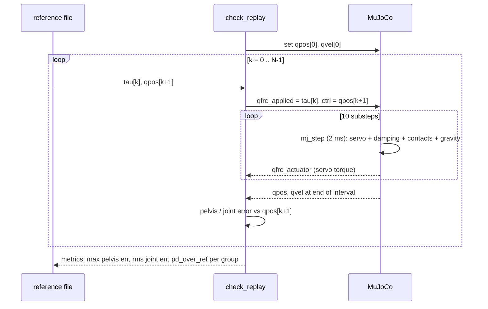
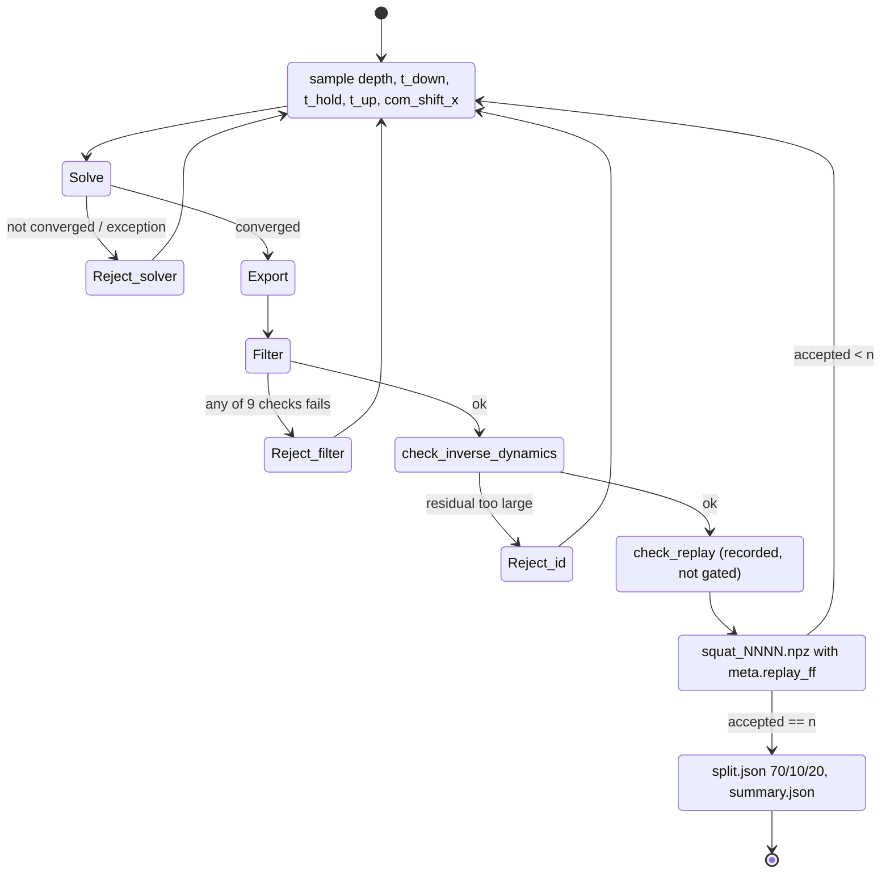

# Trajectory optimization and validation: visual guide

Diagrams for the trajectory-optimization side of the Opt2Skill G1 squat PoC. Each figure shows one
mechanism; the caption under it says what to look for. Mermaid blocks render on GitHub and in most
markdown viewers; ASCII blocks render anywhere. Companion to [hands-on guide](TRAJECTORY_GUIDE.md) and
[knowledge base](../KNOWLEDGEBASE.md). Policy-training diagrams describe proposed work;
see [next steps](NEXT_STEPS.md).

Colour convention used throughout: **amber = optimizer side (Pinocchio, Crocoddyl)**,
**teal = simulator side (MuJoCo)**, grey = shared contract and files.

---

## 1. System map



**What to see.** Two independent descriptions of the same robot enter at the left. The config file
is the one place that holds every number both sides must share. The optimizer never touches MuJoCo
except to read two passive parameters (armature, joint damping) so that its torques mean the same
thing MuJoCo will need. The `.npz` file is the only thing that crosses from the amber side to the
teal side, and policy training consumes only the teal-validated dataset.

---

## 2. Command flow: what each CLI reads and writes



**Reading order for a first session.** Run A, then F, then C on the dev file, then D. B and E are the
two ways to make new files; C and D are the two ways to inspect any file.

---

## 3. The reference file: what is in the npz and how the indices line up

```
   node index k:     0        1        2       ...      N-1       N
                     |        |        |                 |        |
   t          (N+1)  t0       t1       t2               tN-1      tN        t[k] = k * 0.02 s
   qpos       (N+1)  x        x        x                 x        x         36 = 3 pos + 4 quat(wxyz) + 29 joints
   qvel       (N+1)  x        x        x                 x        x         35 = 3 lin(world) + 3 ang(local) + 29
   com, pelvis_*     x        x        x                 x        x         keypoints, N+1 rows
   foot_pos_*, hand_pos_*                                                   pelvis-local positions, N+1 rows
                     |<-- 0 -->|<-- 1 -->|      ...      |<- N-1 ->|
   tau          (N)      x        x                          x              29 joint torques, one per INTERVAL
   foot_wrench_* (N)     x        x                          x              6 = force xyz + torque xyz, world axes at sole

   Rule: interval k starts at state k, is driven by tau[k] and wrench[k] for 20 ms, and ends at state k+1.
   Anything indexed N+1 is a snapshot; anything indexed N is what happened between two snapshots.
```

**Why this matters for policy training.** The policy at step k sees state k and reference k, emits one
action, and MuJoCo runs ten 2 ms substeps. The torque reward compares the mean torque MuJoCo applied
over those substeps with `tau[k]`. Getting this off by one is the classic bug in tracking
controllers; the contract docstring and `validate.py` encode this rule, and the tests check it.

Metadata travels alongside (JSON inside the npz): squat parameters, solver stats, filter details,
and after generation the replay metrics.

---

## 4. The optimization problem as a shooting chain



Every running node is the same object built with a different CoM target:

```
   +------------------------------------------------------------------+
   |  node k   (IntegratedActionModelEuler, dt = 0.02)                |
   |                                                                  |
   |  dynamics: DifferentialActionModelContactFwdDynamics             |
   |     contacts: left_sole 6D, right_sole 6D  (LOCAL_WORLD_ALIGNED) |
   |               Baumgarte gains (100, 20) hold the soles in place  |
   |     armature: copied from the MuJoCo model                       |
   |     hard bounds: -effort <= u <= +effort   (BoxFDDP)             |
   |                                                                  |
   |  costs (weight):                                                 |
   |     com            1e5   ||CoM(q) - c[k]||^2                     |
   |     state_reg      1e0   weighted ||x - x0||^2                   |
   |                          base rotation 100, legs 1, waist 10,    |
   |                          arms 10, all velocities 1               |
   |     joint_limits   1e5   quadratic barrier, 0.04 rad inside      |
   |     *_wrench       1e1   barrier: friction cone (mu 0.6),        |
   |                          CoP inside sole box, 20 N <= fz <= 1 kN |
   |     control_reg    1e-3  ||u||^2                                 |
   +------------------------------------------------------------------+
```

**What to see.** The soles are not on a floor: they are pinned to their initial placement by the
contact constraint, and the contact force is whatever makes that pin hold. The wrench-cone cost is
what keeps that force physically plausible (pressing down, inside the friction cone, centre of
pressure under the sole). The CoM cost is the only thing that says "squat".

---

## 5. What the CoM is asked to do

```
   CoM height (m)
   0.72 |*******                                        *******   stand
        |       **                                    **
        |         *                                  *
        |          *                                *             min-jerk: zero velocity and
        |           *                              *              acceleration at both ends
        |            *                            *
   0.52 |             ****************************                hold
        +----+---------+----------+-----------+---------+---> t (s)
        0   0.5       1.5        1.9         2.9       3.4
        |stand0| t_down |  t_hold  |   t_up    | stand1 |

   Optional: com_shift_x moves the target forward/back by the same bump shape (default 0).
   Depth 0.2 m, t_down 1.0, t_hold 0.4, t_up 1.0 → 3.4 s → N = 170 intervals.
```

---

## 6. Inside BoxFDDP: one iteration



**Vocabulary.** DDP and iLQR are the same backward/forward structure; iLQR drops second-order
dynamics terms. FDDP allows the rollout to be dynamically infeasible in early iterations (gaps between
nodes), which is why a cold start from a repeated pose works. The "Box" prefix means the per-node
control update is solved with torque bounds as hard constraints rather than penalties. The extra
`problem.calc` at the end is a practical gotcha: the internal data holds whatever the last
line-search trial evaluated, not necessarily the accepted solution.

---

## 7. Export and filter: from solver output to a file



**Why the damping term.** Crocoddyl's model has no joint damping. MuJoCo's G1 has passive damping
on every joint, so an actuator that wants to reproduce the optimizer's motion must push harder by
`b · qdot`. The export adds that once so policy training can treat `tau` as "the torque MuJoCo's actuators
should apply". It uses the interval mean of the velocity because `tau[k]` acts over the whole
interval; this convention is why check 1 below has a small correction term.

---

## 8. Validation loops in MuJoCo

### 8.1 Check 1: inverse-dynamics consistency (no simulation, one node at a time)

```
   for k in 0 .. N-1:
       set qpos[k], qvel[k]                       (snapshot k)
       mj_forward                                  (kinematics; note: this overwrites qacc)
       qacc := (qvel[k+1] - qvel[k]) / dt          (what the reference says happened)
       apply foot_wrench[k] at each sole point     (mj_applyFT → qfrc_ext)
       mj_inverse                                  (which generalized force makes this qacc?)
       required := qfrc_inverse - qfrc_ext
       required[joints] += b · ½(qvel[k+1] - qvel[k])   (damping-convention correction, see §7)
       base_res[k]  := required[0:6]               (should be ~0: nothing pushes the pelvis)
       joint_res[k] := required[6:] - tau[k]       (should be ~0: MuJoCo agrees with Crocoddyl)

   contacts, friction loss, actuation, joint limits all DISABLED for the duration.
   Pass: rms joint residual < 0.01 N m, max < 0.2, base force < 5 N, base torque < 2 N m.
   Observed: 0.0007 rms against 5.8 N m rms of reference torque.
```

**What to see.** This check never integrates anything, so it cannot fall over. It asks MuJoCo's
Newton-Euler routine the inverse question: given this motion and these foot forces, what torque was
needed? If the two dynamics models disagree on mass, inertia, or kinematics, the residual grows.
This is the check that gates the dataset.

### 8.2 Checks 2 and 3: stabilized replay (simulation)

```
   control interval k (20 ms)                                  physics: 10 substeps of 2 ms
   |<------------------------------------------------------->|
   |  qfrc_applied[joints] = tau[k]      (feedforward, check 2 only)
   |  ctrl = qpos_ref[k+1, joints]       (position servo target = next snapshot)
   |  mj_step ×10, accumulate qfrc_actuator (what the servo added)
   |
   log: pelvis error vs qpos_ref[k+1], joint error, min pelvis z, PD torque

   torque applied to joint j during interval k:
        tau_applied = tau[k]                 feedforward     (0 in check 3)
                    + kp' · (q_ref - q)      servo, kp' = 4 × Playground kp (300 legs, 400 ankle pitch)
                    - b · qdot               passive joint damping (always on)

   Pass (check 2): no fall (pelvis z > 0.4 m), pelvis error < 3 cm, joint rms error < 0.03 rad,
                   PD torque rms / reference torque rms on the legs < 0.25.
   Check 3 is informational: same gains, no feedforward. It falls on the tested default squat.
```



**What to see.** This configured controller tracks the default squat to about 1.1 cm
with feedforward, while the same gains and targets without feedforward fall. This
measures the contribution of feedforward in this controller; it does not establish
universal failure of PD control or reproduce a learned-policy ablation. Feedforward
bypasses actuator clipping, and the logged effort ratio uses interval means.

---

## 9. The generator as a state machine



Every reject is a line in `rejected.jsonl` with the sampled parameters and a `stage` field, so you
can see which gate is doing the work. The saved dataset reviewed on 2026-09-08: 109 attempts, 100 accepted, 9 filter rejects,
0 solver or inverse-dynamics rejects, replay pass rate 1.0.

---

## 10. The scene in simulation (side view, not to scale)

```
      z ^
        |                 ( )  head
        |                 /|\
        |                 /|\   arms (14 joints, held near home pose)
        |                  |
        |               [pelvis]  ---- pelvis frame: qpos[0:3] position, qpos[3:7] quat (wxyz)
        |                  o      ---- CoM (33.34 kg), 0.72 m up at stand (pelvis z 0.785)
        |                 / \
        |                /   \   hips (3 dof each), knees (1 dof each)
        |               /     \
        |              |       |
        |              |       |
        |   ankle → x  |       |  x ← ankle roll link origin
        |            __|       |__
        |  sole →  [========] [========]  ← foot geom box: half-size (0.09, 0.03, 0.008)
   z=0  +===============================================================> x (forward)
                 ^                                     ^
                 sole frame: ankle link origin +  (0.04, 0, -0.037)
                 foot_wrench_* is expressed here, world axes:
                       f = (fx, fy, fz)   fz ≈ +163 N per foot at rest (half of 327 N)
                       tau = (tx, ty, tz) small; CoP = (-ty/fz, tx/fz) must stay inside the box

   Floor: plane at z = 0, friction 1.0 in the scene (the optimizer plans with 0.6 for margin).
   Contact in MuJoCo is soft: 1.2 mm of penetration at the home keyframe already produced ~78 N,
   which is why the standing state is lifted so the soles start exactly at z = 0.
```

**What to see.** Two things live at the sole point: the optimizer's contact constraint (a frame
pinned in place) and MuJoCo's contact geometry (a box that the floor pushes on). They are made to
coincide by the `sole_offset` entry in the config, and the foot-geometry reconciliation check
verifies that MuJoCo's box sits where the config says.

---

## 11. Frame and layout conventions (the conversion the export does)

```
                    Pinocchio (optimizer)                MuJoCo (simulator)
   ------------------------------------------------------------------------------------
   q / qpos  [0:3]   base position, world             base position, world
             [3:7]   quaternion  x y z w              quaternion  w x y z         <- reorder
             [7:36]  29 joints, same order            29 joints, same order
   v / qvel  [0:3]   base linear vel, BODY frame      base linear vel, WORLD      <- rotate by R(quat)
             [3:6]   base angular vel, BODY frame     base angular vel, BODY      (same)
             [6:35]  29 joint velocities              29 joint velocities         (same)
   torque            u, 29, no damping                tau, 29, includes damping   <- add b·qdot
   contact           wrench at sole frame,            foot_wrench_*, same,        (same)
                     LOCAL_WORLD_ALIGNED               world axes at sole origin
   ------------------------------------------------------------------------------------
   foot and hand keypoints in the file are pelvis-local:  p_local = R(quat)^T (p_world - pelvis_pos)
   pelvis_linvel in the file is pelvis-local (policy convention); qvel[0:3] is world (MuJoCo convention).
```

The reconciliation checks exist to prove the middle column: joint names and order identical, joint
limits equal after the hip-roll override, masses and inertias equal, forward kinematics equal for
random poses, foot box where the config says.

---

## 12. Where policy training plugs in (policy step timing)

```
   step k                                             step k+1
   |                                                  |
   observe:  state k  +  reference k (or a window)     observe: state k+1 ...
   |   Pos:   qpos_ref, qvel_ref, keypoints
   |   Pos+T: ... plus tau_ref[k]      (use_torque_ref flag: obs, reward, critic)
   |
   act:      target = default pose + action           (position servo, Playground kp/kv)
   |         MuJoCo: 10 × 2 ms substeps, accumulate applied torque
   |
   reward:   exp(-w ||q - q_ref[k+1]||^2) + ...       (Table I style)
             + exp(-w ||mean applied torque - tau_ref[k]||^2)     (only with use_torque_ref)
   |
   v
```

The two replay checks provide separate controller baselines. Learned position-based
and torque-informed policies remain to be implemented and evaluated.
